

# Shuffler

### Movies. Series. Anime. Shuffled together, streamed your way.

---

## What is Shuffler?

Shuffler is a free, community-built home for everything you want to watch — movies, TV series, and anime, all in one clean, fast, no-nonsense app. Browse what's trending, pick up exactly where you left off, and start watching in seconds, on your phone, your TV, or your PC.

No clutter. No confusing menus. Just point, pick, and press play.

---

## ✨ What's inside

### 🎬 A library that never runs out
Trending, popular, top-rated, and newly-released movies, series, and anime, all beautifully organized and instantly searchable. Every title comes with real IMDb ratings, a poster-first browsing experience, and an "In Theaters" badge so you always know what's fresh.

### 🔀 Can't decide? Shuffle.
Tap the shuffle mark on Home, answer a few quick questions — your mood, how much time you have, who you're watching with — and **Shuffler AI** picks a movie, a series, or even a single episode for you, revealed with a poster shuffle. Pick one or more titles you love to get something similar, and get anime-specific questions when you're in the anime section. Bring your own key for OpenAI, Claude, Gemini, or open-source models through OpenRouter or Groq.

### 🌸 Anime, with a home of its own
Anime has its own section, completely separate from movies and series: its own Home, Discover and Search, its own watch history, My List and episode calendar, and its own colours.
- **Sub or Dub** — every episode and anime movie offers both, right in the source picker.
- **Beautiful pages** — full-size posters and title logos, carefully matched so you never see a live-action adaptation by mistake.
- **Skip Intro, Outro & Recap** — powered by AniSkip.
- **Its own languages** — set anime audio and subtitle languages separately from everything else.
- **Download episodes** — one at a time, or select several and grab them all in one go.

### 🎯 Built around your taste
Tell Shuffler what you like once, and your own personal **For You** row keeps getting smarter — genuinely tailored picks, not generic "trending" filler. Prefer full control? Customize which genre rows appear on your Home screen, and in what order.

### 📡 Watch your way
Shuffler doesn't lock you into one source. Choose the streaming method that fits you:
- **Direct streaming** — a fast, high-quality source with clear tags for resolution, HDR/HEVC, dual audio, and more.
- **Peer-to-peer streaming** — for the widest possible selection.
- **CloudStream plugins** — power users can browse and install community add-ons straight from an in-app repo store.

### ⏭️ Playback that respects your time
- **Up Next** — a small card appears as an episode wraps up, so you can jump straight into the next one without lifting a finger to search.
- **Skip Intro, Recap & Outro** — real, community-sourced skip points for TV shows, with an optional auto-skip mode.
- **Resume, exactly** — pick up a movie or episode right where you paused it, every time, on the same source you were already watching from.
- **Subtitles that look right** — search and download subtitles for the exact episode you're watching, and fine-tune their size, color, and position live inside the player.

### ✅ Keep track of everything
- **Watched, or not yet** — mark any episode as watched or unwatched, and it stays in sync across your devices.
- **Always on the right episode** — details pages open on the episode you're up to, in the right season, ready to resume or start the next one. Continue Watching moves on to the next episode by itself.
- **Watch status** — every title you add to My List gets a status: Plan to Watch, Watching, or Completed — and your lists show up as rows right on Home.
- **Episode calendar** — see when new episodes of the shows in your list come out, and get a notification the moment one lands.
- **Start fresh** — reset a title's watch progress anytime (with a quick confirmation, so you never lose it by accident).

### ⬇️ Take it offline
Download movies, full seasons, single episodes, or a handful of anime episodes at once for offline viewing. The Downloads page shows each download's live progress and when it will finish, groups your shows by season and episode, and lets you delete a whole show, a season, or a single episode — always with a confirmation first. Downloads keep going in the background, automatically retry if something hiccups, and pause on mobile data if you'd rather save it for Wi-Fi.

### 🔔 Stay in the loop
A notification bell keeps you posted on news from the Shuffler team — new features, announcements, and things worth checking out — right inside the app. And after every update, a quick **What's New** popup shows you exactly what changed.

### 🌍 Made to feel like home
Full Arabic language support with proper right-to-left layout, alongside English — more languages on the way.

---

## 🖥️ Also on Windows

Shuffler isn't just a phone app. The **Shuffler Windows app** brings the exact same library, streaming sources, and playback features to your desktop — with a proper big-screen layout, keyboard shortcuts, system tray controls, and native download notifications. Perfect for the living room PC or a lazy Sunday on the couch. **(WIP)**

## 📺 Android TV

**Shuffler for Android TV is out of beta — anyone can sign in.** A full TV experience, built from the ground up for the couch and a remote control — not a stretched phone app.

- **Plays everything** — HEVC (x265), 10-bit, HDR, and AV1 videos play through your TV's own hardware decoder, at your screen's full resolution.
- **Sign in in seconds** — scan the QR code on your TV with your phone (Profile → Sign in on TV in the Shuffler app), or enter the code on the website. No typing passwords with a remote.
- **Search your way** — the Android TV keyboard, or just say it with voice search.
- **Everything from the phone app** — Continue Watching, For You, your custom genre rows, My List with watch status, the episode calendar, the full anime section with Sub and Dub, Shuffler AI, skip intro/recap/outro with auto-skip, subtitle styling right in the player, and switching sources without leaving the player.
- **Idle mode** — leave the TV alone for a while and Shuffler turns into a full-screen slideshow of movies, series and anime with artwork, details and logos. Choose when it starts, what it shows, how long each slide stays, the clock and its format, and when the TV goes to sleep.
- **Your home screen, your style** — pick a black, white, green, or anime-coloured Shuffler banner for your TV's home screen, or the special anime banner.

### Install it on your TV

On your Android TV, Google TV, or Fire TV, install the free **Downloader** app (by AFTVnews) from your TV's app store, open it, and enter this code:

## `5267155`

Downloader fetches and installs the latest Shuffler TV app for you — no computer or USB stick needed. You can also grab the TV APK from the [website](https://shuffler-web.vercel.app/#download).

---

## 📱 See it in action

### 📱 On your phone

### 📺 On Android TV

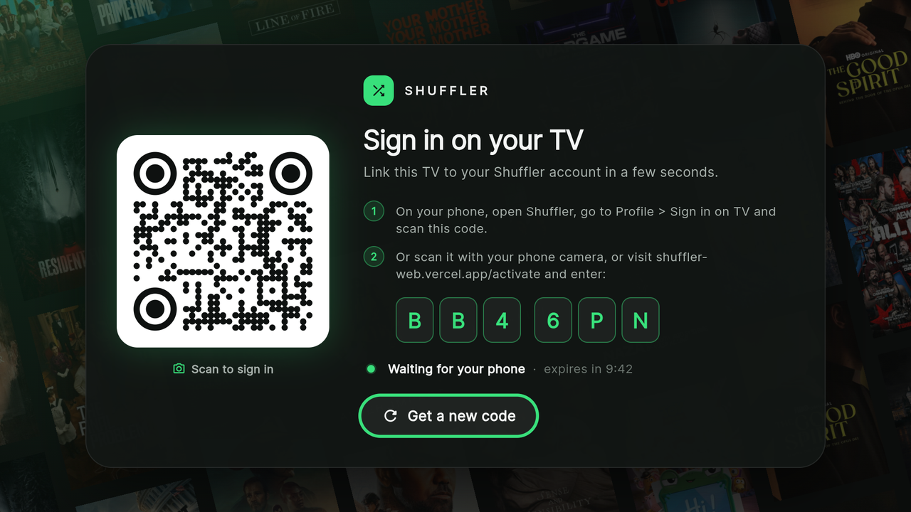
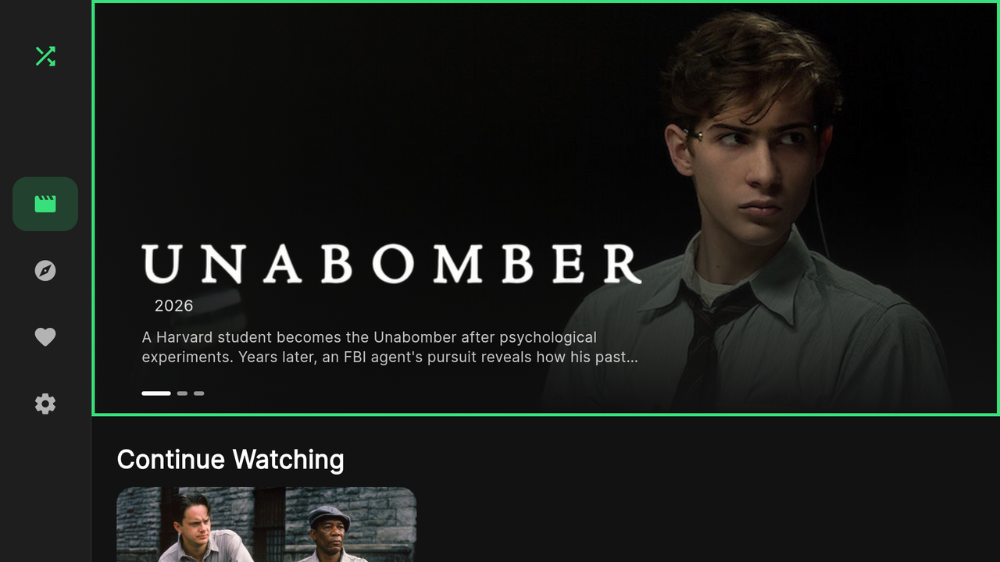
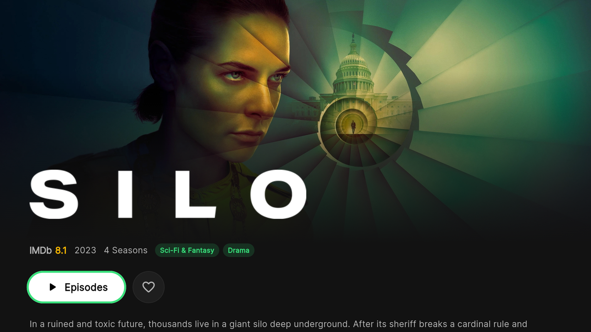
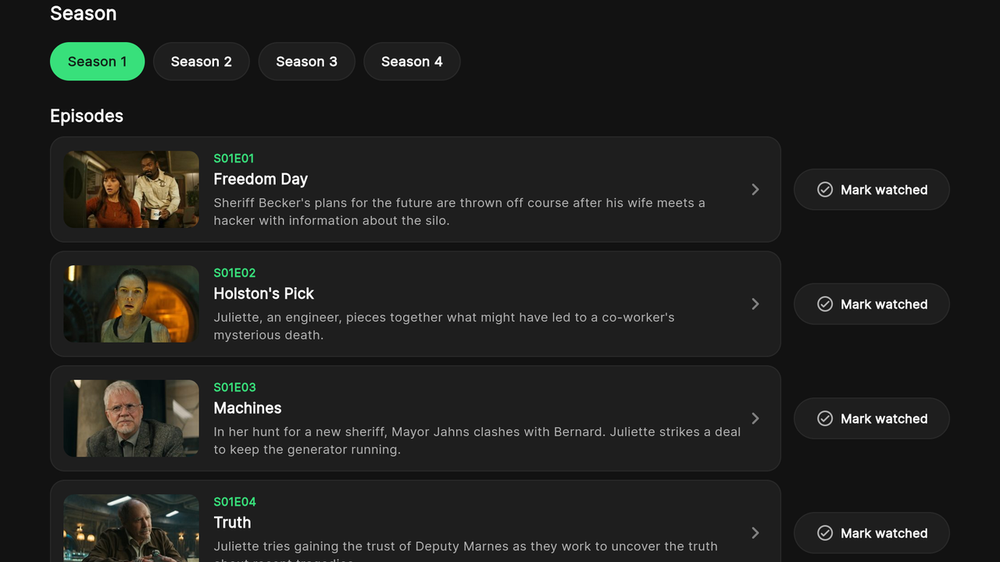
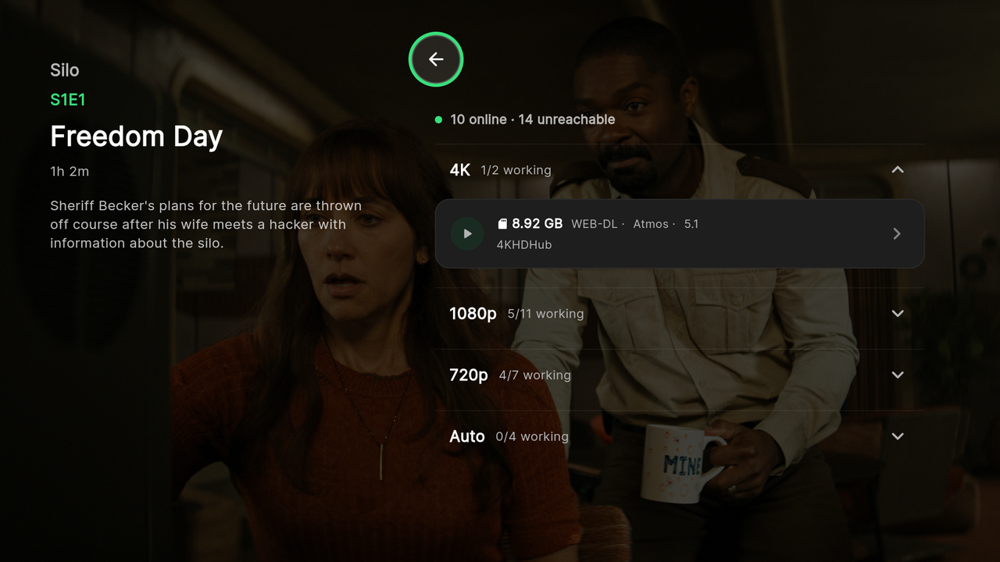
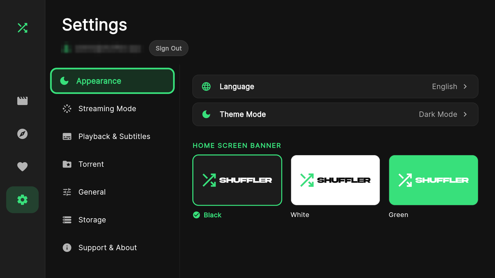
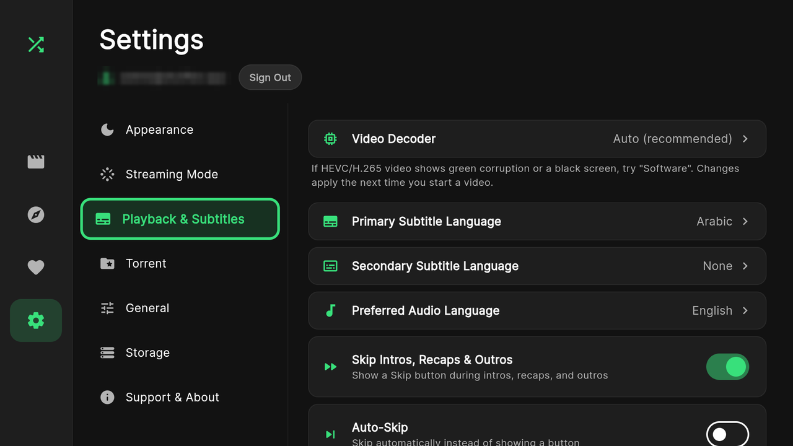
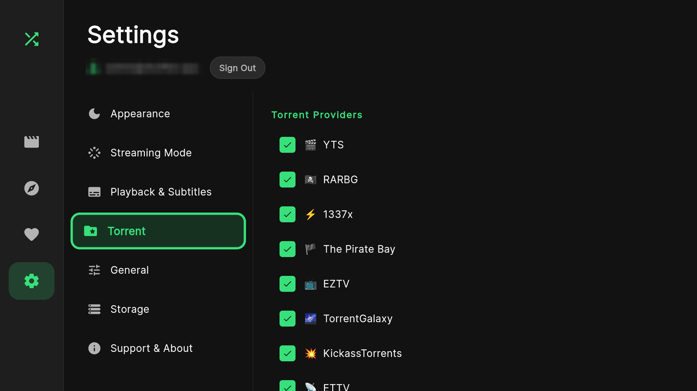
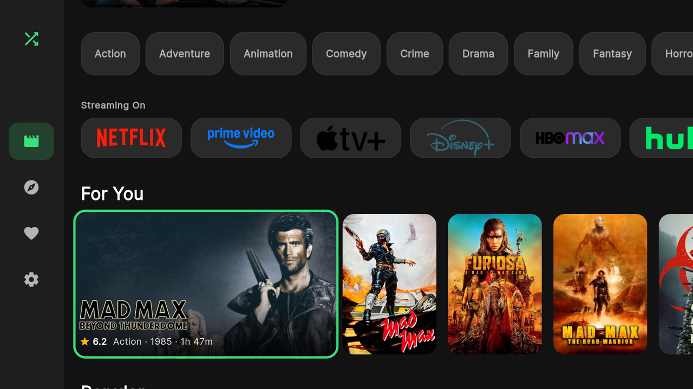
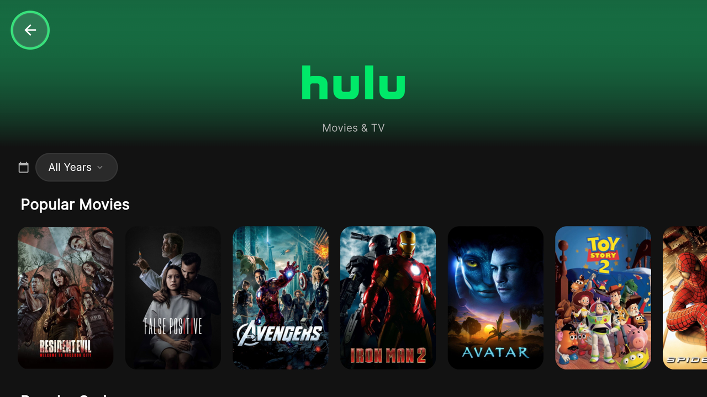
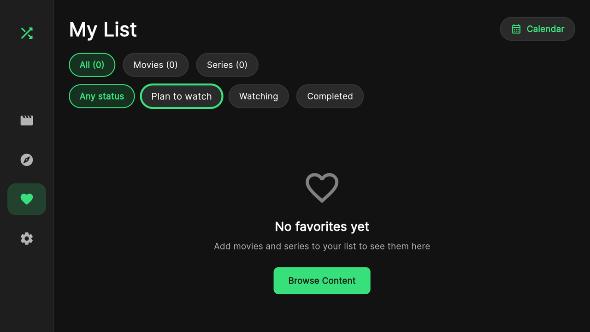
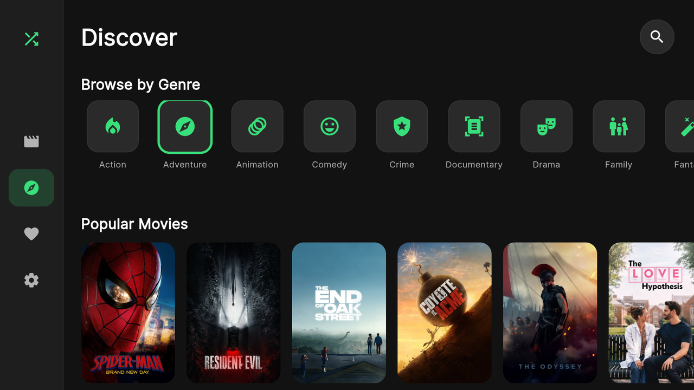
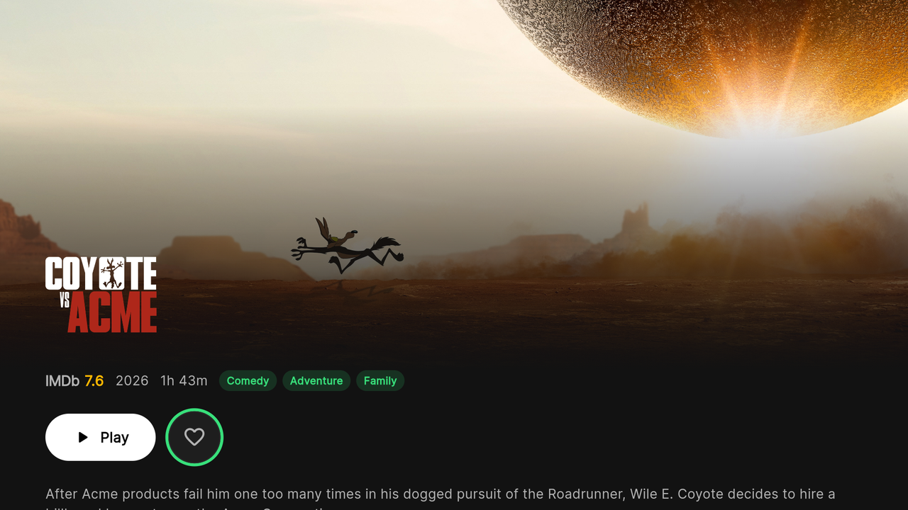
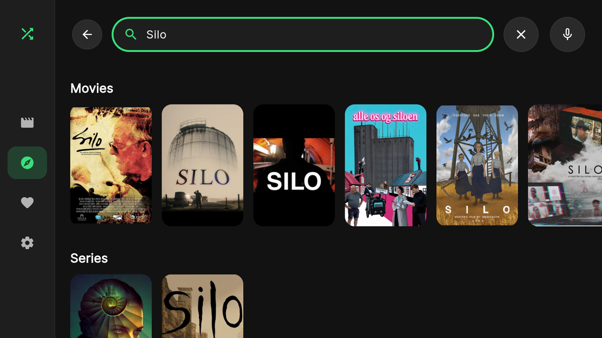
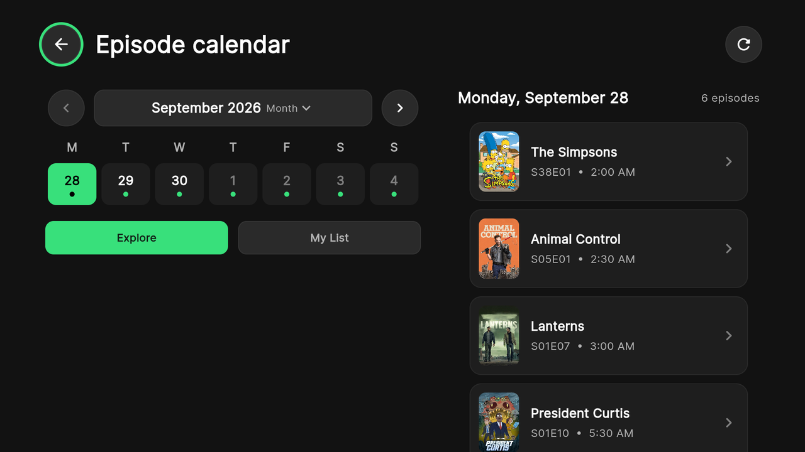
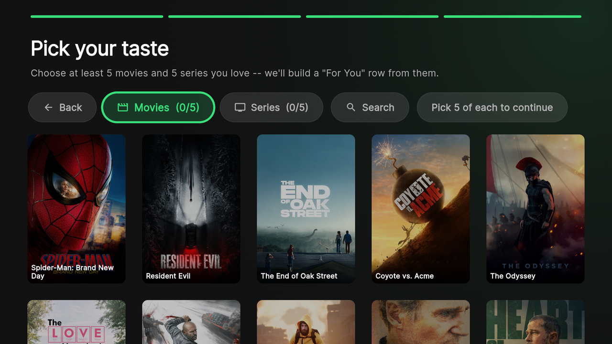
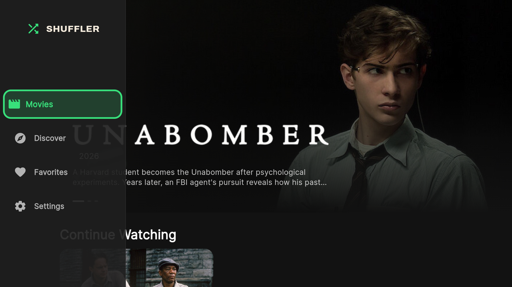

---

## ⬇ Download

Grab the latest Android APK from the [**Releases**](https://github.com/xeljazwix/ShufflerApp/releases) page of this repository. New versions land there first, alongside the full list of what's new in each one.

---

## 🪙 Enjoying Shuffler?

Shuffler is free, ad-light, and built by people who just wanted a better way to watch. If it's earned a spot on your home screen, consider dropping a coin in the jar — every bit helps keep it alive and growing.

### [🪙 Support Shuffler on Coindrop](https://coindrop.to/shuffler)

---

## 💬 Join the Community

Got a feature idea, found a bug, or just want to hang out with other people who love movies? Our Discord is the heart of the project — announcements, early looks at what's coming, and direct chats with the people building Shuffler.

### 

## Credits

- Anime TV banner artwork by **Sonika Rud** (free with attribution).
